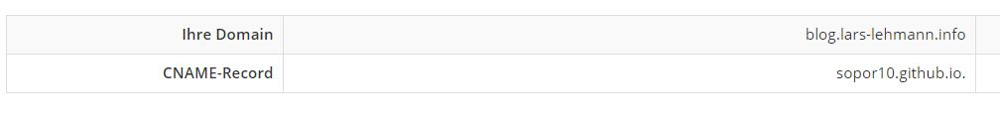

Dieser Blog ist eine Github Pages Seite.

Es gibt diverse Templates, die kompatibel zu Github Pages sind.
Ich habe mich für [Minimal Mistakes](https://github.com/mmistakes/mm-github-pages-starter) entschieden.

### Schritte:
1. Anpassen der `_config.yml` an meine Bedürnisse.
2. Github Pages unter Settings aktivieren.
3. Custom Domain eintragen.

   

4.  `cname` Eintrag für `sopor10.github.io.` anlegen.

    

Soweit zu meinem Setup. 
Bis zum nächsten mal.